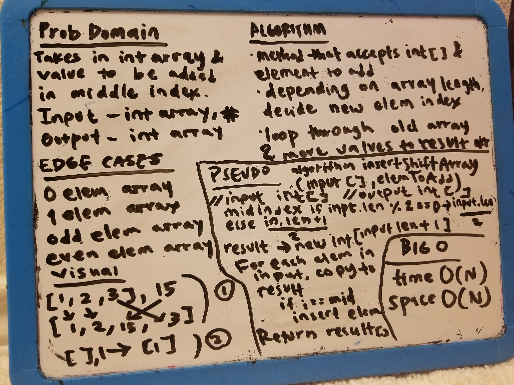

# Challenge Summary

## Challenge Description
The insertShiftArray method takes in an array and the value to be added. 
Without utilizing any of the built-in methods available to java, 
the function returns an array with the new value added at the middle index.
## Approach & Efficiency
The function checks for edge cases and handles them.
I use a loop where there is a conditional to see if the index
equals the middle. The middle is determined by a conditional statement
that checks to see the input array length is odd or even.
Time complexity of is O(N) as the original array must be iterated
one time.
Space complexity is O(N), as an additional array of N + 1, is used.

There is another approach that results in cleaner code, but space and time
complexity are the same. Instead of having a check for a one-element input 
array edge case, I could put all my logic in the for loop.
In the for loop, there could be three conditionals.
1. if i < middleIndex, result[i] == input[i]
2. else if i equals middle index, result[i] == elementToEnter
3. else result[i] == input[i - 1] ---> we know the array shifted after
additional element, so we have to account for that.

While I like the aforementioned approach, as it may result in cleaner, more readable
code, I decided to keep my original implementation.

## Solution
[Code](./src/main/java/Library.java)

