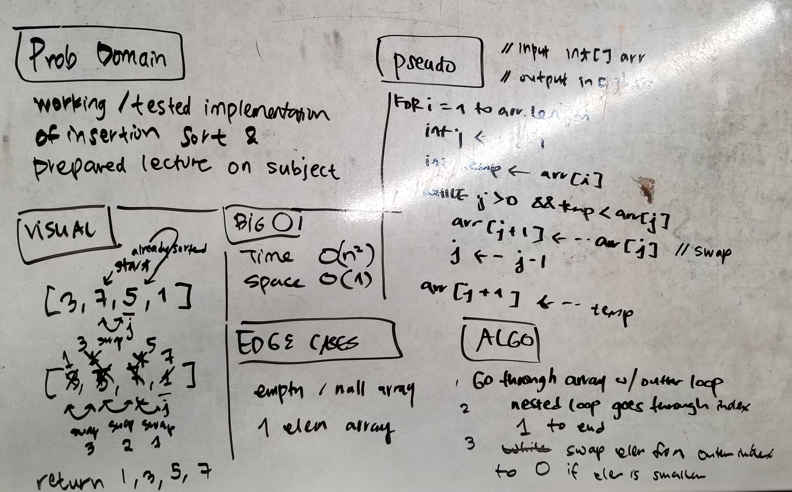

# Challenge Summary
This directory contains the working algorithm for insertion sort and a [lecture](./LECTURE.md) flow.

## Challenge Description
This sort algorithm requires two loops. In the inner loop, a pointer moves to index 0. If the element
at index i is smaller, there is a swap to that index.

## Approach & Efficiency
The worst case running time is O(n^2), as the inner interation may have to iterate to index 0 for each outer loop iteration.

Space is O(1) - number of variables are impervious to data size.

## Solution
<!-- Embedded whiteboard image -->
