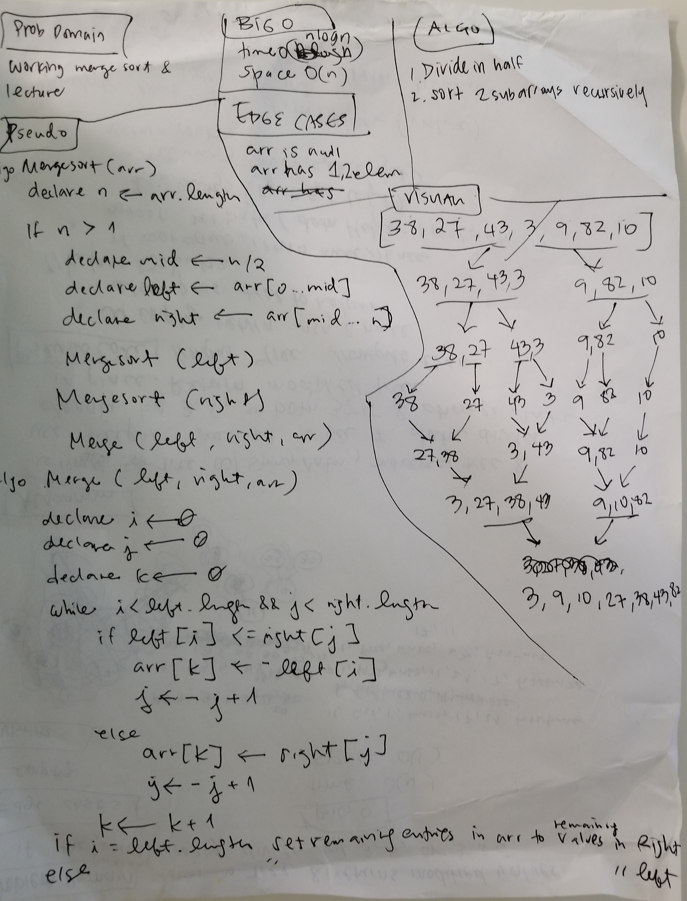

# Challenge Summary
<!-- Short summary or background information -->
Merge sort working code and [lecture](./LECTURE.md)

## Challenge Description
<!-- Description of the challenge -->
Working merge sort from algorithm provided and
lecture outline

## Approach & Efficiency
<!-- What approach did you take? Why? What is the Big O space/time for this approach? -->
**time** O(nlogn)
**space** O(N)

## Solution
<!-- Embedded whiteboard image -->
