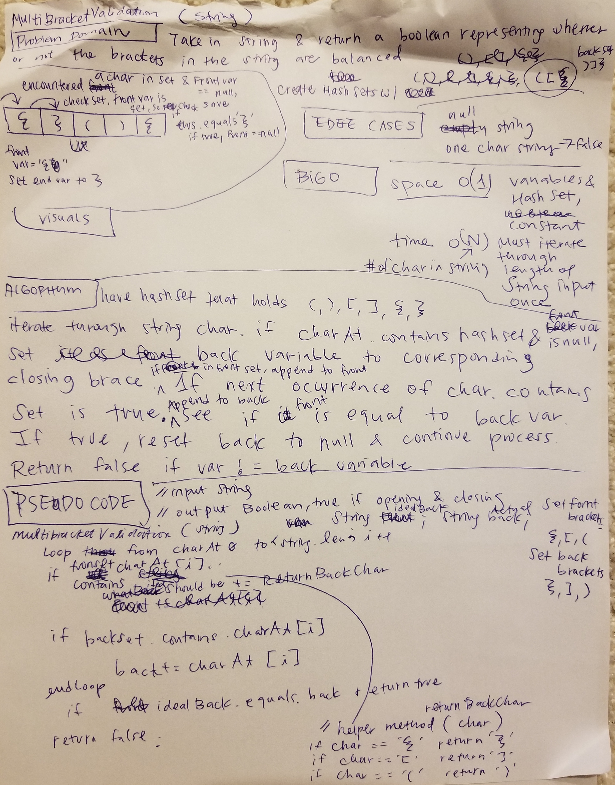

# Challenge Summary
### MultiBracket Validation

## Challenge Description
The multiBracketValidation static method takes in a String and returns a Boolean if it contains
brackets that are paired correctly (opening and closing brackets match in sequence).

## Approach & Efficiency
I decided to use String variables to store the ideal closing bracket sequence and the 
actual closing bracket sequence. These Strings are compared each time a closing bracket
is encountered up to the length of the actual closing bracket variable, and returns false
if there is a difference. In addition, the two variables are evaluated at the end of the
String iteration.

Two HashSets are used to store opening and closing brackets, which are used to check
for characters as the String is iterated.

A private helper method appends the correct closing bracket to the ideal closing bracket
sequence variable, which the actual closing bracket sequence checks against.

+ Empty and null String values passed throws errors.
+ A String passed with length of one returns false.
+ A String that does not contain any brackets returns true, but has a message
that alerts the user that the String did not contain brackets.

**Time complexity** is O(N), with N being number of characters in the String 
- worst case scenario is the whole String is iterated.

**Space complexity** is O(1)
- the number of variables is constant, regardless of length of String.

I am aware this problem could have been solved with two Stacks vs Strings, but that would
have meant space complexity would have been O(N).

## Solution
[Code](./src/main/java/multibracketvalidation/MultiBracketValidation.java)

