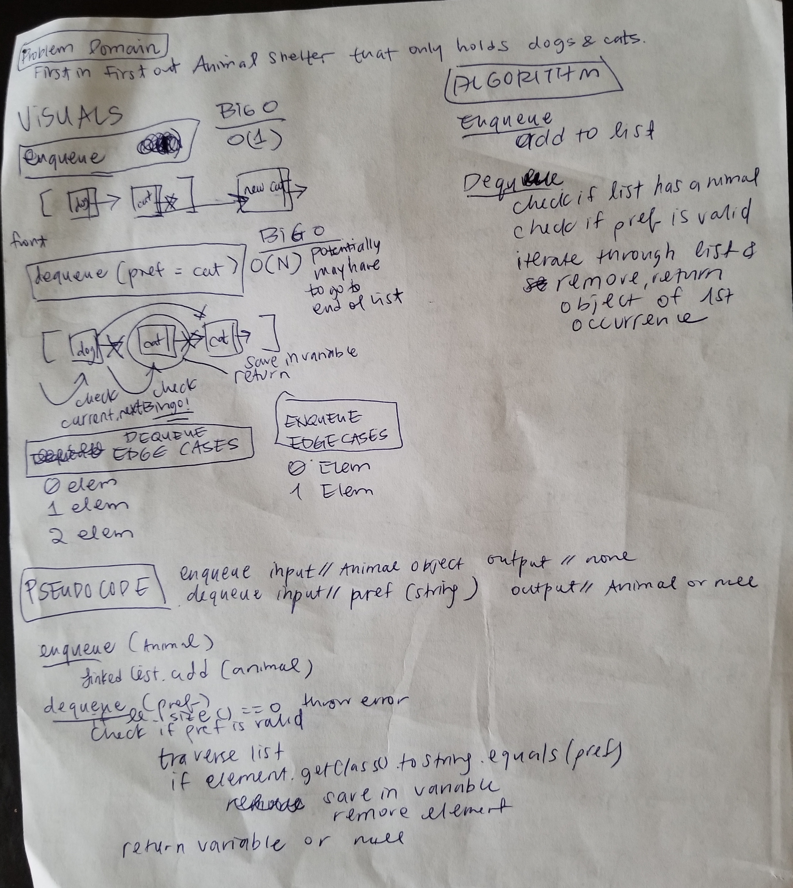

# Challenge Summary
#### Animal Shelter
## Challenge Description
Animal Shelter class that only holds dogs and cats.
Enqueue adds an animal.
Dequeue deletes an animal by preference (Cat or Dog).
## Approach & Efficiency
Originally, I drafted my solution with thoughts of my own structures, 
but after I read some documentation, found Java's Linked List class has
all the methods I need.

I created an abstract parent class so I could make a Linked List of Animals, 
which is contained in my Animal Shelter class. 

I check the getClass().toString() and compare it to the param pref to check 
whether I should dequeue the first occurrence of Cat or Dog.

**`dequeue(pref)`**

O(N) time - worst case is if the animal is at the end of the list.

O(1) space - constant variables, impervious to data size.

**`enqueue(Animal)`**

O(1) time - always adds to the first element in the list,
constant amount of steps.

O(1) space - constant variables, impervious to data size.

## Solution
[Code](./src/main/java/animal_shelter)

