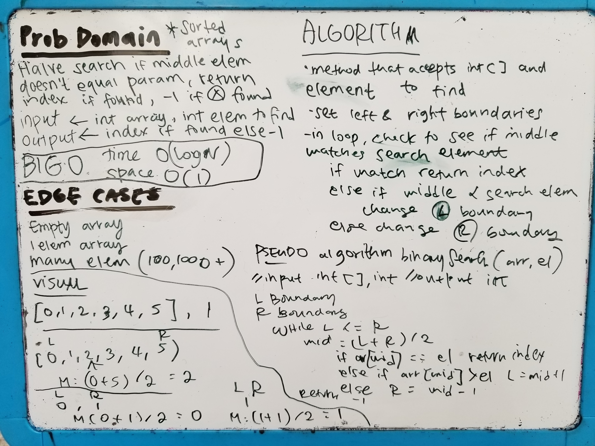

# Challenge Summary

## Challenge Description
Binary search. The method takes in a sorted int array and an element to search for.
Left and right boundaries are set as the ends, and the middle is searched. 
If the middle element is not a match to the search element, the boundaries
changed. The search are is halved continuously until the boundaries pass one another, 
or the element is found.
## Approach & Efficiency
I set the left and right boundaries and in a while loop, change and evaluate the middle.
While the left and right boundaries do not cross, the array area is halved and searched.
If the element is found, the index is returned. Else, -1 is returned, which indicates
the element does not exist in the array.
Time complexity is O(logN) as search is performed by halving the search area.
Space complexity is O(1), as no additional structures are used.
## Solution
[Code](./src/main/java/arr_binary_search/Library.java)

