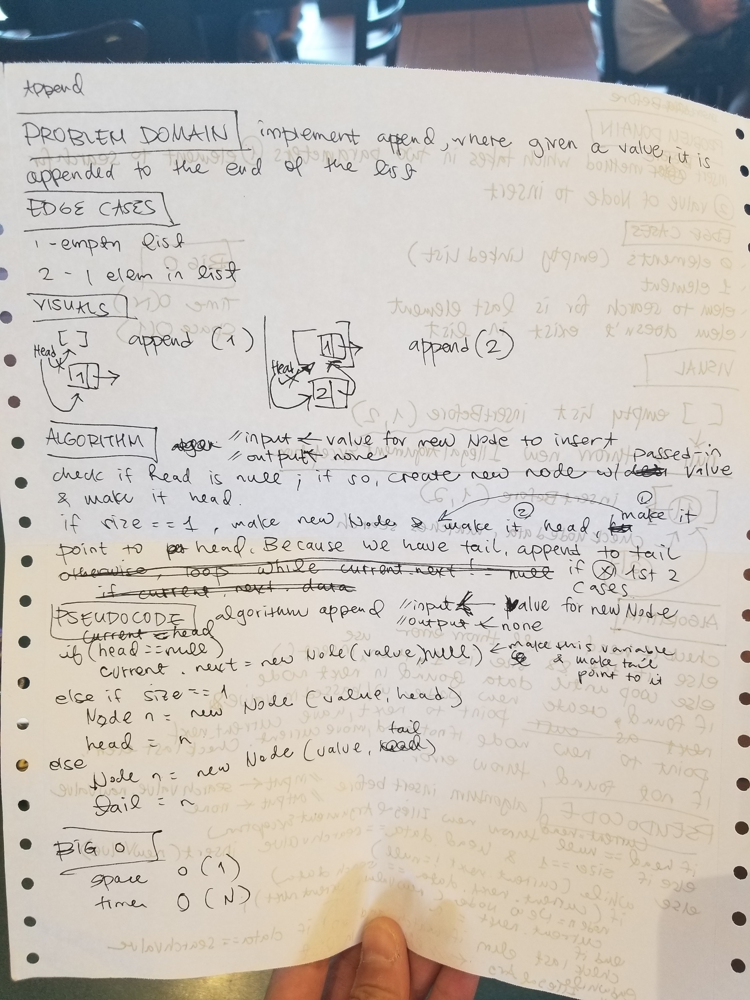
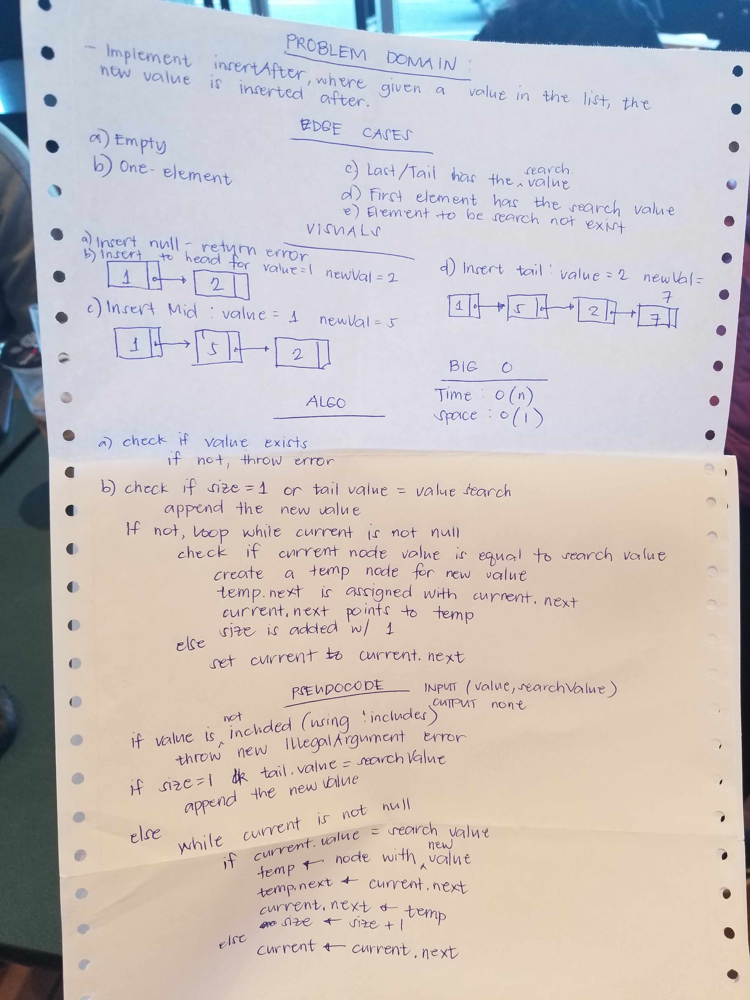
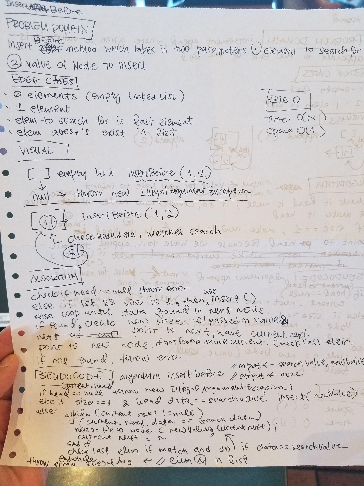
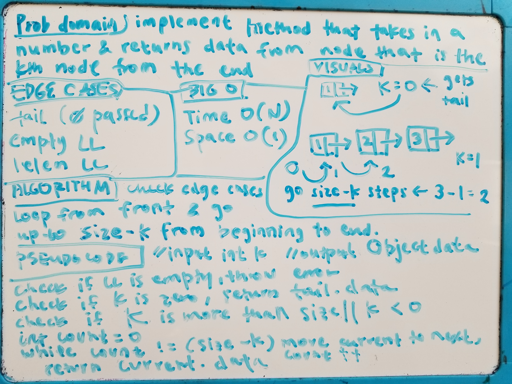
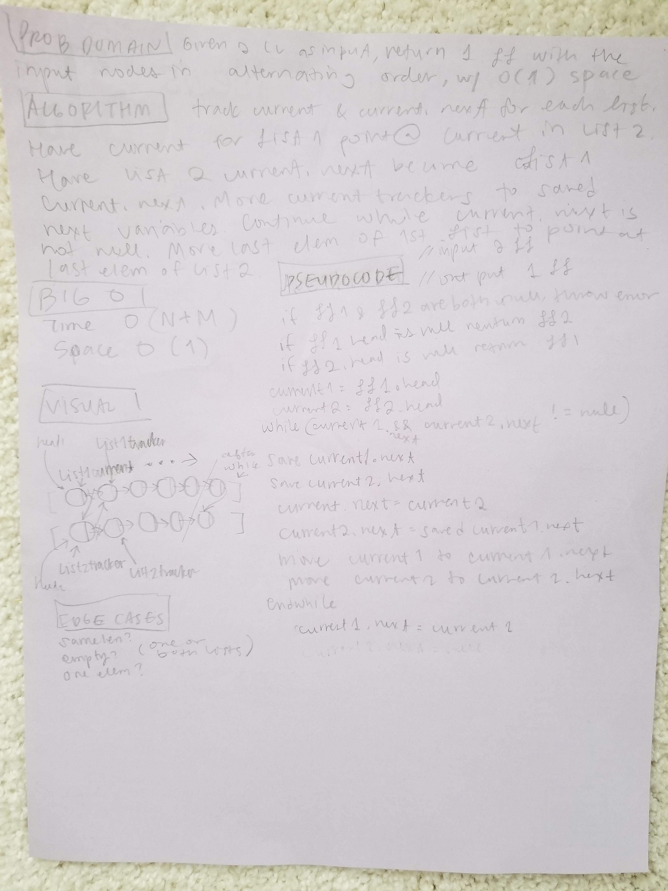

# Singly Linked List
<!-- Short summary or background information -->

## Challenge
<!-- Description of the challenge -->
Create singly linked list.

## Approach & Efficiency
[code](./src/main/java/Data/Structures/LinkedList.java)

*append*

*insertAfter*

*insertBefore*

*kthFromEnd*

*mergeLists*

### Big O:
First, I wrote the methods with int.
Then, I changed to accept Object, and modified some of the methods ie == has to be .equals.
I included a size property, so I could include it in test, and a few getters.
I had to write a constructor, vs using default, so I could refresh size to 0 every time a new linked list
is instantiated (which is what I want, instead of a shared size for all instances created).

#### For Code Challenge
Implemented more methods with edge cases, handle errors when element is not found.

**`insert`** 
time O(1) - constant amount steps, impervious to data size; 
space O(1) - one new node created each time;

**`includes`** 
time O(N) worst-case : has to search until the end of the linked list;
space O(1) - no additional data structures used.

**`print`** 
time and space are O(N) : iterates through list one time, every time, and uses
additional data structure with N elements (array list).

**`append`** 
time and space are O(1) : I have tail which tracks the last node, 
so it is constant amount of steps, impervious to amount of data.

**`insertBefore`**
time O(N) : worst-case is at the end of the list, so must iterate through N steps.
space O(1) : constant amount of space to create and attach new node.

**`insertAfter`**
time O(N) : worst-case is at the end of the list, so must iterate N steps.
space O(1) : constant amount of space to create and attach new node.

**`kthValueFromEnd`**
time O(N) : worst-case value is value one from last, or N - 1 steps -> O(N).
space O(1) : constant amount of variables used.

**`mergeLists`**
time O(N + M) : must look at all nodes in first list (N)
and all nodes in second list (M).
space O(1) : constant amount of variables,
impervious to change in input size.

## API
`Insert(value)`
Takes any value as an argument
and adds a new node with that value
to the head of the list with an O(1) Time performance

@param data int value to insert in new node
 
`Includes(searchValue)`
Takes any value as an argument
and returns a boolean result depending
on whether that value exists
as a Node’s value somewhere within the list.

@param searchValue int to search for

@return boolean true if value is found, else false
 
`print()`
Takes in no arguments
and returns an ArrayList
of the current Node values in the Linked List.

@return list of all values in linked list

`append(value)`
Adds a new node with the given value to the end of the list.

@param value data for Node to be inserted at end

`insertBefore(searchElement, newValue)`
Adds a new node before a search element. If the value is not in the list,
an Illegal Argument Exception is thrown.

@param searchElement data to search find

@newValue data for new Node, which is to be appended to list before searched element

`insertAfter(searchElement, newValue)`
Adds a new node after a search element. If the value is not in the list,
an Illegal Argument Exception is thrown.

@param searchElement data to search find

@newValue data for new Node, which is to be appended to list before searched element

`kthValueFromEnd(value)`
Takes a number, k, as a parameter.
Return the node’s value that is k from the end of the linked list.
If value is negative number or larger than ll size, IllegalArgumentException is thrown.
If list is empty, NullPointerException is thrown.

@param k value from the end of linked list

@return Object value at the kth node from the end of the linked list

`mergeLists(listOne, listTwo)`
Take in two linked lists, merge them with
alternating nodes from each list, and return
one linked list.

@param one linked list

@param two linked list

@return linked list

`getHeadData()` 
Getter for head data.

@return value of head element

`getSize()`
Getter for size of linked list.

@return int how many elements are in list

`getTailData()`
Getter for tail data.

@return tail data
