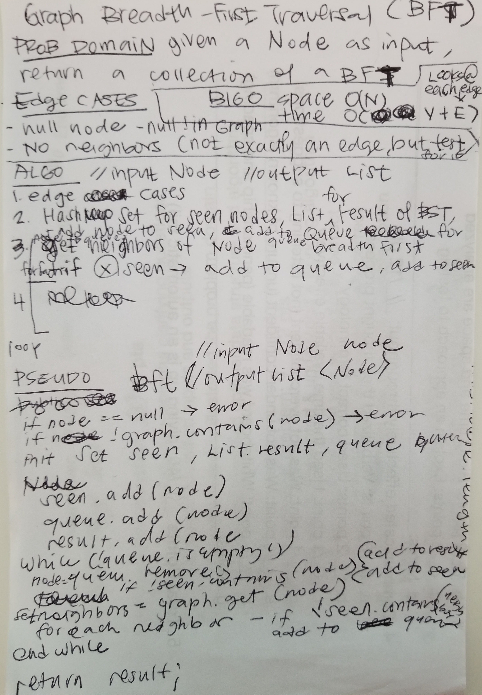
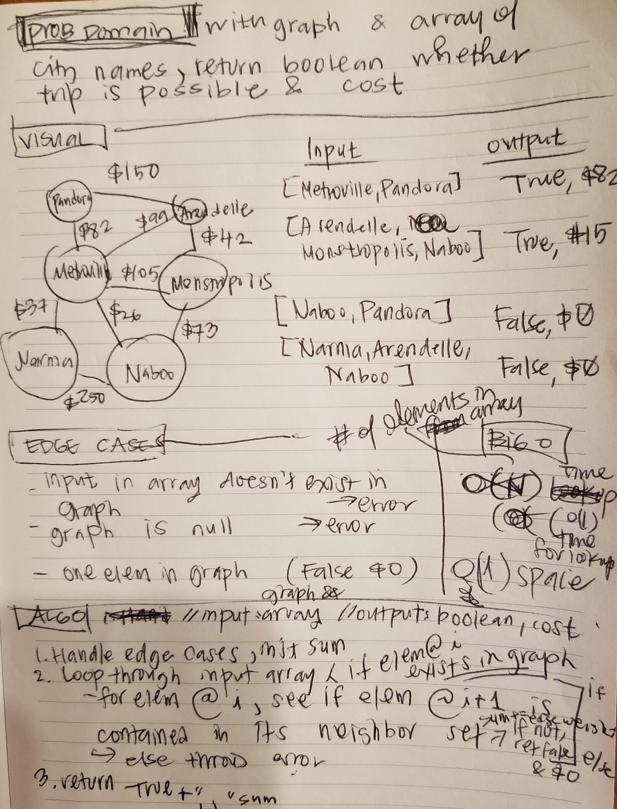

# Graph
Implemented adjacency list simulated in HashMap of Nodes (Vertices) as keys, and Set of Neighbors as values.

## Approach and Efficiency
+ Used HashMap and Sets for O(1) lookup and add time
+ Update is also O(1) time - constant number of steps, impervious to data size
+ Space O(1) for lookups and adding is constant

## API

`AddNode()`
Adds a new node to the graph
+ Takes in the value of that node
+ Returns the added node

`AddEdge()`
+ Adds a new edge between two nodes in the graph
+ Include the ability to have a “weight”
+ Takes in the two nodes to be connected by the edge
    + Both nodes should already be in the Graph

`GetNodes()`
+ Returns all of the nodes in the graph as a collection (set, list, or similar)

`GetNeighbors()`
+ Returns a collection of nodes connected to the given node
+ Takes in a given node
+ Include the weight of the connection in the returned collection

`Size()`
+ Returns the total number of nodes in the graph`

`GetEdge(Node[] cities, Graph graph)`
+ Returns boolean and cost if direct flight is possible

`dft(Node origin)`
+ Returns list of depth first traversal

## Challenge Summary
<!-- Short summary or background information -->
Breadth first traversal on graph with input Node as origin

### Challenge Description
<!-- Description of the challenge -->
Use Visited Set to manage visited vertices, Queue for breadth first traversal

### Approach & Efficiency
<!-- What approach did you take? Why? What is the Big O space/time for this approach? -->
Queue to manage Nodes to visit, Seen Set so duplicate Nodes are not visited

#### Big O
Time: O(V + E) -> Need to look at every Node and all the neighbors (edges)
Space: O(V) -> Queue could hold all the Vertices

## Solution
<!-- Embedded whiteboard image -->
`bft(Node node)`
+ Returns Set of breadth first traversal with origin at input Node

## Challenge Summary
<!-- Short summary or background information -->
Get Edges

### Challenge Description
<!-- Description of the challenge -->
Given an input of City arrays and a graph, it returns true with the cost if a direct flight
is possible. False with cost of 0 is returned if a direct path is possible.

### Approach & Efficiency
<!-- What approach did you take? Why? What is the Big O space/time for this approach? -->
Iterate through array, see if element at next is included in neighbors list, check edge list and get weight.

#### Big O
Time: O(V + E) -> Need to look at every Node and all the neighbors (edges)
Space: O(V + E)

## Solution
<!-- Embedded whiteboard image -->
`getEdge(Node[] array, Graph graph)`
+ Returns True or False with cost

