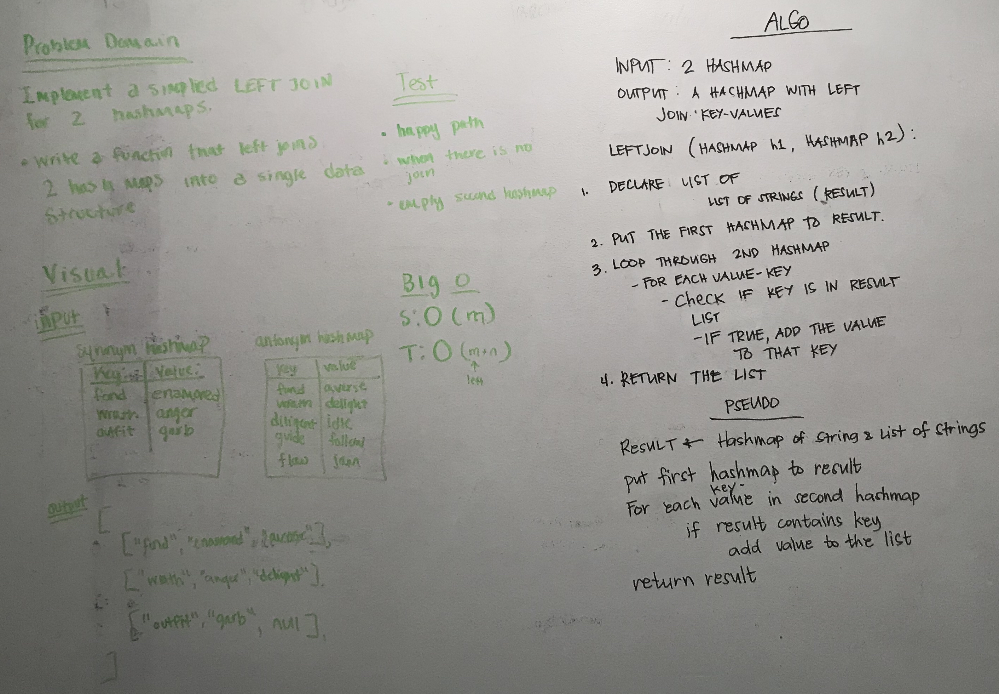

# Hashmap LEFT JOIN
<!-- Short summary or background information -->
Given two HashMaps, one with synonyms and the other with antonyms, as input, return a joined HashMap with
the key and both synonym and antonym (if the key exists in the second hashMap)

## Challenge
<!-- Description of the challenge -->
Join the second HashMap value to the first Hashmap key if it exists.

### Stretch goal
Additional method that takes in third param String joinType, which may be "left" or "right". Case-insensitive, ignores
spaces before and after.

## Approach & Efficiency
<!-- What approach did you take? Why? What is the Big O space/time for this approach? -->
I iterate through the first HashMap and add its key and value to my result HashMap.
The result HashMap stores a String[] as the value. The left tree value is at index 0.
I iterate through the second Map, and if the key exists in the result Map, I get the value array, place
the right Map value in index 1, and update the key - value in the result Map.

I chose a HashMap as the data structure to return because it has good lookup time.

`public static Map<String, String[]> leftJoin(Map<String, String> synonyms, Map<String, String> antonyms)`

`public static Map<String, String[]> join(Map<String, String> synonyms, Map<String, String> antonyms, String joinType)`

### Big O
**Space:** N <- number of elements in left HashMap

**Time:** N + M <- number of elements left and right HashMap

## Solution
<!-- Embedded whiteboard image -->

white boarding, mob (with jorie, liz, xia)
