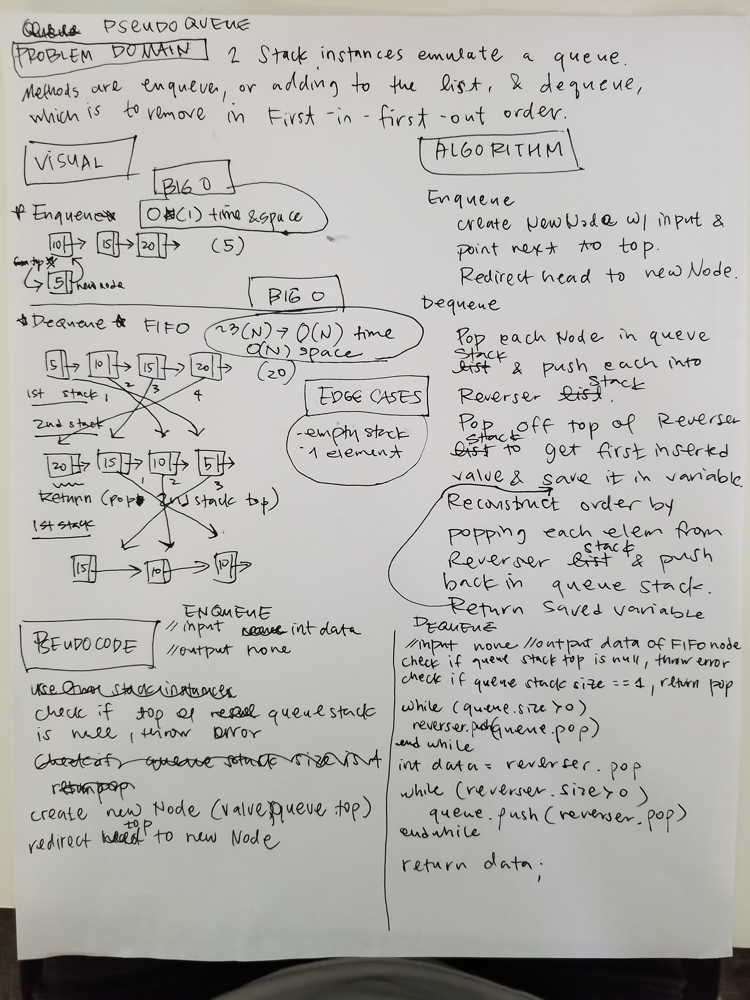

# Pseudo Queue
<!-- Short summary or background information -->

## Challenge
<!-- Description of the challenge -->
Create a Pseudo Queue class that acts like a queue
but is actually two Stacks.

## Approach & Efficiency
[code](./src/main/java/pseudoqueue/QueueWithStacks.java)

### Big O:
**`enqueue`**
Time and space are O(1): With top property, could create new Node that points to top, 
and redeclare top to the new Node.

**`dequeue`**
Time O(N): List is parsed 3x -> O(N).

SpaceO(N): additional structure with N elements needed to reverse stack order.

#### For Code Challenge

**`enqueue(value)`** 
time O(1) - constant amount steps, impervious to data size; 
space O(1) - one new node created each time;

**`dequeue()`** 
time O(N) has to go through all nodes 3 times -> still N time.
space O(N) - additional structure that holds all N nodes.

## API

`enqueue(value)`
Adds a Node with the passed in value to the top of the queue.

`dequeue()`
Removes the first inserted Node and returns its data.

@return data of removed Node
