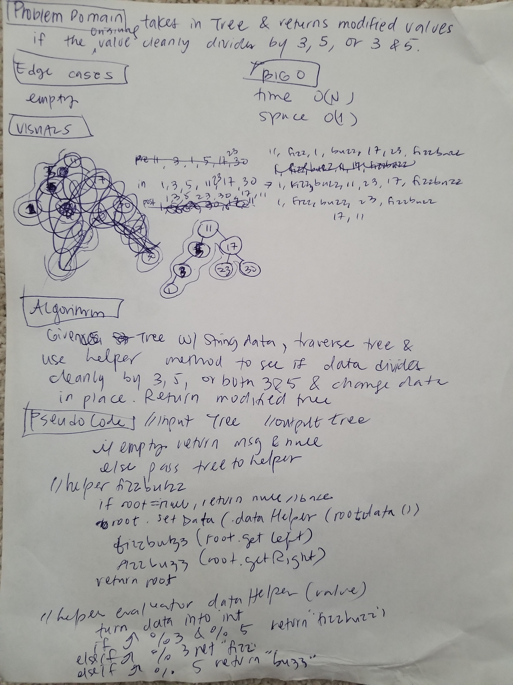

# Bread First (BF)
<!-- Short summary or background information -->
#### Breadth First Traversal
## Challenge
<!-- Description of the challenge -->
Write a breadth first traversal.

## Approach & Efficiency
**`breadthFirst(Tree)`**

Time O(N) must visit each node.

Space O(N) for a list that returns data. Only used this for testing purposes; 
else, space would be O(1) if I simply sysout the data to console.

Use a linked list to keep track of Nodes to visit. 
Put root in linked list.
Pull out first Node and print data (or in this case, add to ArrayList),
check if left and right children exist and put them into list
if they do.
Iterate until list is empty.

[test](./src/test/java/tree/BstTest.java) - under BstTest

## API
**`breadthFirst(Tree)`**
Not a static method. No input, return ArrayList of data in breadth first order.

**`printBreadthFirst()`**
Not a static method. No input, no output. Prints out node in BF order.