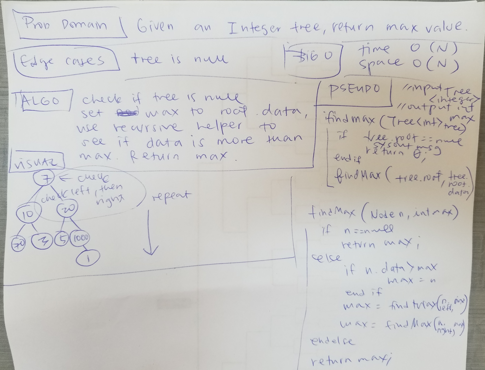

# Trees
<!-- Short summary or background information -->
#### Binary Tree and Binary Search Tree (BST)
## Challenge
<!-- Description of the challenge -->
Implement Tree and Binary Search Tree.
Used generic data type.
Worked collaboratively with Jorie Fernandez on Tree and BST classes.

## Approach & Efficiency
<!-- What approach did you take? Why? What is the Big O space/time for this approach? -->
Used generics.
Tree is parent class.
BST extends from Tree.
FizzBuzzTree extends from BST.

Tree class traversals:
inorder, 
preorder,
postorder

**`add(value)`**
Time O(logN) - chooses subtree based on value comparison.
Space O(1)

**`contains(value)`**

Time O(logN) - chooses subtree based on value comparison.
Space O(1)

**`fizzbuzztree(Tree)`**

Time O(N) - must evaluate each Node data.
Space O(1) - in-place change so no extra data structures are used.

##### fizzbuzz

## Find Max Value
For finding the max value:
1. wrote a static method with recursive helper that
    replaces the max value if the node value is larger that what is held in the variable.
    
    O(N) Time - must look at each node.
    
    O(N) Space - recursion make a stack call for each Node so that is N times.

2. wrote a static method that does breadth first traversal and
    replaces the max value if the node value is larger that what is held in the variable.
    
    O(N) Time - must look at each node.
    
    O(N) Space - linked list that potentially holds all the Nodes.

##### findMaxValue

## API
#### Tree
**`contains(value)`**

#### BST
**`contains(value)`**

#### FizzBuzzTree
**`fizzbuzztree(Tree)`**

#### FindMaxValue
**`findMaxValue(Tree <Integer>)`**

#### BreadthFirstFindMaxValue
**`breadthFirstFindMaxValue(Tree <Integer>)`**

