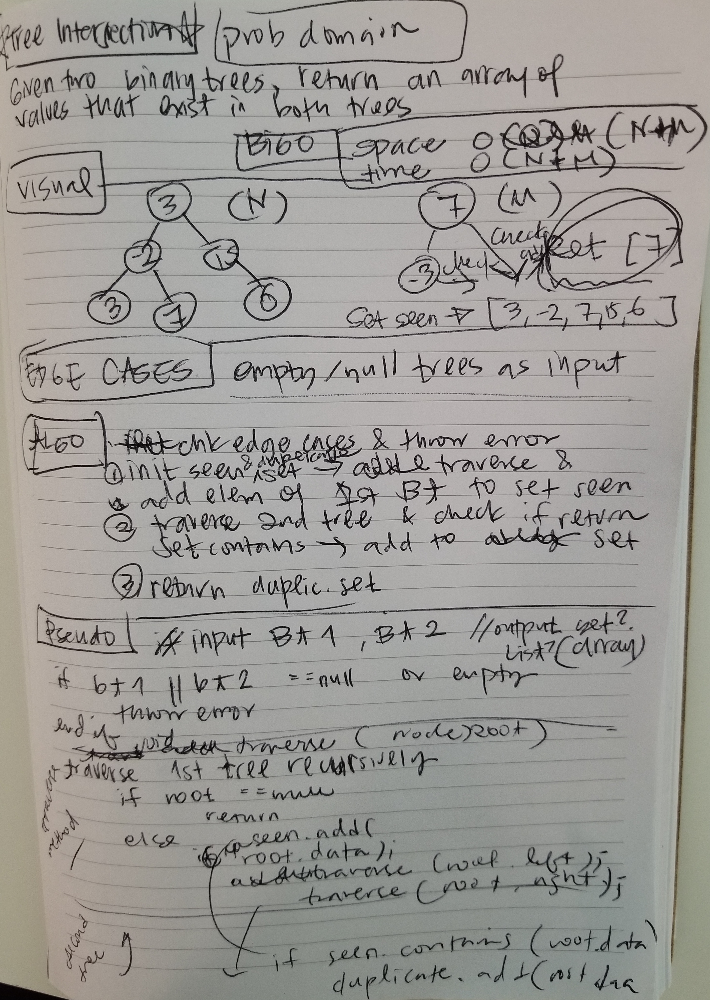

# Tree Intersection

## Challenge Description
Finds common values in 2 binary trees.

## Approach & Efficiency
<!-- What approach did you take? Why? What is the Big O space/time for this approach? -->
I recursively traverse through the first tree and save the elements in a Set, which prevents duplicates.
Then I recursively traverse through the second tree and compare each element against the 'seen' Set. If the seen
Set contains the same data, it is added to a 'duplicate' Set.
The duplicate Set is returned with any values that are contained in both trees.

### Big O
**Space:** O(N) -> N being the number of elements in the first tree, or second tree (whichever is less).
The number of duplicates cannot exceed more than the size of one tree.

**Time:** *traversal time* O(N + M) -> N being the number of elements in the first tree, M being the number of elements
in the second tree. Each element must be looked at once.

*Lookup time / comparison time* is O(1) because I am using HashSets.

## Solution
<!-- Embedded whiteboard image -->
